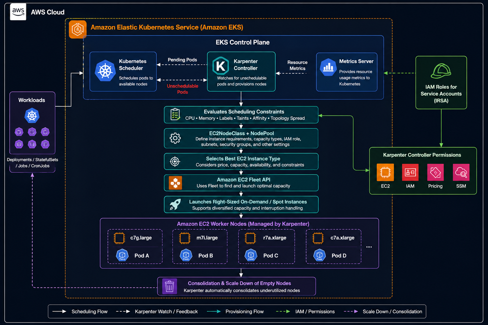

## 🚀 Karpenter on Amazon EKS – Production-Ready Setup Guide

> Deploy and configure **Karpenter** on **Amazon EKS** using **IAM Roles for Service Accounts (IRSA)**, **EC2NodeClass**, **NodePool**, and **Spot/On-Demand provisioning** to build a scalable, cost-optimized, production-ready Kubernetes platform.

---

## 📑 Table of Contents

* [📖 Project Overview](#-project-overview)
* [🚀 What is Karpenter?](#-what-is-karpenter)
* [✨ Features](#-features)
* [🏗️ Architecture Overview](#️-architecture-overview)
* [✅ Prerequisites](#-prerequisites)
* [🔐 Configure IAM Roles for Service Accounts (IRSA)](#-configure-iam-roles-for-service-accounts-irsa)
* [⚙️ Install Karpenter](#️-install-karpenter)
* [🏷️ Configure AWS Resource Discovery](#️-configure-aws-resource-discovery)
* [🧩 Create an EC2NodeClass](#-create-an-ec2nodeclass)
* [🖥️ Create a NodePool](#️-create-a-nodepool)
* [📈 Validate Autoscaling](#-validate-autoscaling)
* [💰 Spot & On-Demand Best Practices](#-spot--on-demand-best-practices)
* [🔥 Production Best Practices](#-production-best-practices)
* [🚨 Troubleshooting](#-troubleshooting)
* [🧹 Cleanup](#-cleanup)
* [📚 References](#-references)
* [🎯 Conclusion](#-conclusion)

---

## 📖 Project Overview

Karpenter is the next-generation Kubernetes node autoscaler for Amazon EKS. Unlike traditional autoscaling solutions, it provisions infrastructure directly based on the scheduling requirements of pending pods, enabling faster scaling, improved resource utilization, and lower infrastructure costs.

This repository demonstrates a **production-ready Karpenter deployment** on Amazon EKS using Infrastructure as Code and AWS best practices, including:

* IAM Roles for Service Accounts (IRSA)
* Dynamic EC2 provisioning
* EC2NodeClass and NodePool resources
* Spot and On-Demand capacity
* Intelligent scheduling
* Node consolidation
* Cost optimization
* Production-ready scaling strategies

---

## 🚀 What is Karpenter?

Karpenter is an open-source Kubernetes node lifecycle controller developed for Amazon EKS.

Instead of increasing the size of predefined Auto Scaling Groups, Karpenter provisions the most appropriate EC2 instances in real time based on workload requirements.

## Key Benefits

* ⚡ Faster node provisioning
* 📦 Intelligent bin-packing
* 💰 Lower infrastructure costs
* 🚀 Direct EC2 provisioning
* 🌐 Automatic instance type selection
* 🎯 Spot Instance optimization
* 🔄 Node consolidation
* 📈 High scheduling efficiency

---
## ✨ Features

* Production-ready Amazon EKS deployment
* IAM Roles for Service Accounts (IRSA)
* Dynamic EC2 instance provisioning
* EC2NodeClass configuration
* NodePool configuration
* Spot and On-Demand capacity management
* Automatic node consolidation
* Intelligent scheduling constraints
* Cost optimization
* Production scaling best practices

---
## 🏗️ Architecture Overview



---
## ✅ Prerequisites

Ensure the following components are available before deploying Karpenter:

* Amazon EKS Cluster (v1.27 or later)
* kubectl configured
* AWS CLI configured
* Helm v3
* IAM OIDC Provider enabled
* Existing worker nodes
* Properly tagged VPC subnets
* Properly tagged security groups

---

## 🔐 Configure IAM Roles for Service Accounts (IRSA)

Karpenter requires AWS permissions to interact with infrastructure resources.

Typical permissions include:

* Amazon EC2
* IAM PassRole
* AWS Systems Manager (SSM)
* AWS Pricing API
* Amazon EKS APIs

Create an IAM Role and associate it with the Karpenter Service Account using IRSA.

---
## ⚙️ Install Karpenter

Deploy Karpenter using the official Helm chart.

The installation includes:

* Karpenter CRDs
* Controller deployment
* Service Account
* IRSA annotation
* Controller resource limits
* Cluster configuration

---
## 🏷️ Configure AWS Resource Discovery

Karpenter discovers networking resources using AWS resource tags.

### Required Subnet Tag

```text
karpenter.sh/discovery=<cluster-name>
```

### Required Security Group Tag

```text
karpenter.sh/discovery=<cluster-name>
```

---
### 🧩 Create an EC2NodeClass

The EC2NodeClass defines the infrastructure configuration used when provisioning EC2 instances.

Typical configuration includes:

* AMI Family
* IAM Role
* VPC Subnets
* Security Groups
* Storage configuration
* AMI selection
* Metadata options

---
### 🖥️ Create a NodePool

A NodePool defines how Karpenter provisions worker nodes.

Typical configuration includes:

* Instance architecture
* Capacity type
* Instance families
* Scaling limits
* Scheduling constraints
* Consolidation policies
* Node expiration
* Resource limits

---
### 📈 Validate Autoscaling

Deploy a workload that requests more CPU than the existing nodes can provide.

Verify the scaling process:

```bash
kubectl get pods
```

Check controller logs:

```bash
kubectl logs -n karpenter deployment/karpenter
```

Verify newly provisioned nodes:

```bash
kubectl get nodes
```

---
### 💰 Spot & On-Demand Best Practices

| Workload               | Recommended Capacity |
| ---------------------- | -------------------- |
| Production APIs        | Mixed                |
| Critical Services      | On-Demand            |
| Stateless Applications | Spot                 |
| CI/CD Workloads        | Spot                 |
| Batch Jobs             | Spot                 |

---
## 🔥 Production Best Practices

### Use Multiple Instance Types

Avoid depending on a single EC2 instance type to improve availability.

Examples:

* c6i.large
* c7a.large
* m6i.large
* m7i.large
* r6i.large

---
### Enable Node Consolidation

Automatically remove underutilized nodes to reduce infrastructure costs.

---
### Use Private Subnets

Deploy worker nodes in private subnets for improved security.

---

### Use IRSA

Grant AWS permissions through IAM Roles for Service Accounts instead of static credentials.

---
### Restrict Node Limits

Configure CPU and memory limits to prevent unexpected scaling and infrastructure costs.

---
### Diversify Capacity

Use a mix of:

* Spot Instances
* On-Demand Instances
* Multiple Availability Zones
* Multiple EC2 families

---
## 🚨 Troubleshooting

### Karpenter Cannot Discover Subnets

Verify:

* Subnet tags
* Security group tags
* Discovery tag values

---
### AccessDenied Errors

Verify:

* IAM Policy
* IAM Role
* IRSA annotation
* OIDC Provider
* Trust relationship

---
### Nodes Not Launching

Inspect controller logs:

```bash
kubectl logs -n karpenter deployment/karpenter
```

Check:

* EC2NodeClass
* NodePool
* AWS quotas
* Instance availability
* VPC configuration

---
## 🧹 Cleanup

Delete the NodePool:

```bash
kubectl delete nodepool default
```

Remove Karpenter:

```bash
helm uninstall karpenter -n karpenter
```

---
## 📚 References

* Amazon EKS Documentation
* Karpenter Documentation
* Kubernetes Documentation
* Helm Documentation

---
## 🎯 Conclusion

Karpenter modernizes node autoscaling for Amazon EKS by provisioning infrastructure dynamically based on workload requirements instead of relying on predefined Auto Scaling Groups.

Compared to traditional node autoscaling solutions, Karpenter provides:

* Faster node provisioning
* Intelligent workload-aware scheduling
* Improved bin-packing efficiency
* Dynamic EC2 instance selection
* Native Spot Instance optimization
* Automatic node consolidation
* Lower infrastructure costs
* Simplified cluster operations

For organizations building modern cloud-native platforms on Amazon EKS, Karpenter provides a scalable, efficient, and production-ready approach to Kubernetes node autoscaling.
---